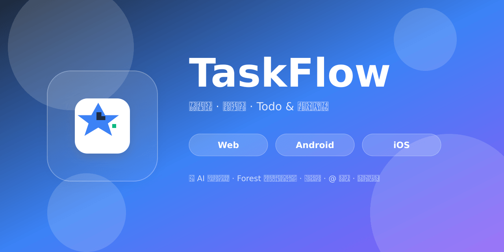

<div align="center">
  

# 📱 TaskFlow

**现代化、跨平台、零依赖云同步的 Todo & 任务管理 App**

[](https://github.com/badhope/TaskFlow)
[](https://www.typescriptlang.org/)
[](https://reactnative.dev/)
[](https://expo.dev/)
[](LICENSE)
[]()

[✨ 快速开始](#-快速开始) · [📱 功能列表](#-完整功能列表) · [📖 文档](#-更多文档) · [🌐 在线 Demo](https://github.com/badhope/TaskFlow)

</div>

---

## 🎬 项目预览

### 任务管理 · 智能建议 · 专注模式

<p align="center">
  
</p>

### 多视图 · 数据看板 · 拖拽排序

<p align="center">
  
</p>

### 拖拽重排（PanResponder 跨平台实现）

<p align="center">
  
</p>

> 💡 示意图为矢量 SVG，可在任何分辨率下清晰显示。**运行 `npm run web` 即可获得完整动态体验。**

---

## ✨ 项目亮点

| 维度 | 特性 |
|---|---|
| 🌍 **跨平台** | 同一份代码运行在 Web / Android / iOS，零平台特定分支 |
| 🤖 **AI 驱动** | 5 种智能建议：时间/优先级/分类/合并/子任务，基于本地历史 |
| 🎯 **专注模式** | Forest 风格全屏沉浸 + 番茄钟 + 6 种白噪声（Web Audio API） |
| 💬 **协作** | @提及 + 实时建议列表 + 评论高亮（受 GitHub / Slack 启发） |
| 🎨 **设计** | Material Icons 体系，零 emoji，专业级深色/浅色主题 |
| 📦 **零后端** | 本地优先 + AsyncStorage 持久化，隐私友好 |
| 🧩 **可扩展** | 20+ 通用组件，6 种视图，Zustand 模块化 store |

---

## ✨ 完整功能列表

### 🔑 核心功能
- ✅ 创建、编辑、删除任务
- ✅ 标记任务完成/未完成 + 撤销操作
- ✅ 任务详情页（描述、分类、标签、子任务、附件、评论、依赖）
- ✅ 任务分类管理
- ✅ 任务标签管理
- ✅ 6 种视图（看板/甘特图/时间线/表格/思维导图/时间块）
- ✅ 任务筛选与多列排序
- ✅ 全局搜索 + 搜索历史
- ✅ 滑动手势（左滑删除，右滑完成）
- ✅ 子任务管理
- ✅ **拖拽重排**（PanResponder 跨平台实现）

### 🚀 高级功能（v1.1 新增）
- 🤖 **AI 任务建议**：基于完成历史的智能优先级/时间/合并/拆分建议
- 🎯 **专注模式**：Forest 风格全屏沉浸 + 番茄钟（25/5/15 分钟循环）
- 🔊 **白噪声播放**：白/粉/棕噪声 + 雨/海/森林 6 种程序化生成
- 💬 **@ 提及**：评论中 @ 触发 + 实时成员建议
- ☑️ **多选批量操作**：Things 3 风格底部操作栏
- 🔗 **任务依赖**：可视化 blockedBy/dependencies
- 🎙️ **语音输入**（Web 端 Web Speech API）
- ⚡ **全局快捷键**：Cmd/Ctrl+N 新建、Esc 取消多选

### 📊 数据管理
- ✅ 项目管理
- ✅ 目标管理
- ✅ 习惯追踪
- ✅ 笔记管理
- ✅ 模板管理
- ✅ 自动化规则
- ✅ 日历视图
- ✅ 统计分析（含完成趋势、分类饼图）

### 🎨 用户体验
- ✅ 深色/浅色主题切换
- ✅ Material Icons 图标系统，零 emoji
- ✅ 响应式设计（Web 三栏，移动单栏）
- ✅ 骨架屏 + 空状态 + 错误状态
- ✅ 底部导航 + Stack 嵌套路由
- ✅ 直观的筛选面板
- ✅ 全局 Toast 通知 + Undo

### 🛡️ 设置与数据
- ✅ 数据导出/导入
- ✅ 本地缓存管理
- ✅ 数据重置
- ✅ 通知开关
- ✅ 主题色板预览

---

## 🛠️ 技术栈

- **React Native 0.73** - 跨平台移动框架
- **Expo 50** - 开发与构建平台
- **TypeScript 5.x 严格模式** - 类型安全
- **React Navigation v6** - 底部导航 + 堆栈导航
- **Zustand 4** - 轻量级状态管理
- **AsyncStorage** - 本地数据持久化
- **Material Icons** - 6000+ 矢量图标
- **Animated + PanResponder** - 手势动画系统（无需 reanimated）
- **Web Audio API** - 程序化白噪声生成（仅 Web）

---

## 📋 项目结构

```
.
├── App.tsx                      # 应用入口，挂载底部导航
├── app.json                     # Expo 配置（图标/启动图/Favicon）
├── package.json                 # 项目依赖
├── tsconfig.json                # TypeScript 严格模式
├── babel.config.js              # Babel 配置
├── eas.json                     # EAS Build 配置
├── assets/                      # 资源（图标/启动图/Favicon）
│   ├── icon.svg / icon.png      # 1024×1024 App 图标
│   ├── adaptive-icon.png        # Android 自适应图标
│   ├── splash.png               # 1284×1284 启动图
│   ├── favicon.svg / favicon.png
│   └── apple-touch-icon.png
├── .github/
│   ├── workflows/               # 4 个 CI/CD workflow
│   └── preview/                 # README 矢量示意图
├── screens/                     # 15 个屏幕
│   ├── HomeScreen.tsx           # 主屏幕（智能建议 + 任务列表）
│   ├── TaskDetailScreen.tsx     # 任务详情（@提及 + 依赖）
│   ├── CalendarScreen.tsx
│   ├── AnalyticsScreen.tsx
│   ├── GoalsScreen.tsx
│   ├── HabitsScreen.tsx
│   ├── NotesScreen.tsx
│   ├── ProjectsScreen.tsx
│   ├── CategoriesScreen.tsx
│   ├── TagsScreen.tsx
│   ├── ViewsScreen.tsx
│   ├── TemplatesScreen.tsx
│   ├── AutomationScreen.tsx
│   ├── SearchScreen.tsx
│   └── SettingsScreen.tsx
└── src/
    └── shared/
        ├── store/index.ts       # Zustand 全局状态（1100+ 行）
        ├── types/index.ts       # 类型定义（1500+ 行）
        ├── hooks/               # 3 个自定义 hooks
        ├── utils/               # NLP 解析器
        └── components/
            ├── common/          # 20 个通用组件
            │   ├── Toast · Pomodoro · QuickAddTask · EmptyState
            │   ├── LoadingState · MultiSelectBar · FocusMode
            │   ├── TaskDependencies · VoiceInput · DraggableList
            │   ├── WhiteNoisePlayer · MentionInput · TaskSuggestions
            │   └── Button · Card · Input · TaskCard · Modal · ...
            └── views/           # 6 种视图
                ├── KanbanView · GanttView · TimelineView
                ├── TableView · TimeBlockView · MindMapView
```

---

## 🚀 快速开始

### 前置要求

- **Node.js 18+**
- **npm** 或 yarn
- （可选）**Expo Go** App（用于移动端真机调试）

### 安装与运行

```bash
# 1. 克隆仓库
git clone https://github.com/badhope/TaskFlow.git
cd TaskFlow

# 2. 安装依赖
npm install

# 3. 启动 Web 端（最快）
npm run web

# 启动 Android（需要 Android Studio / 真机）
npm run android

# 启动 iOS（需要 macOS + Xcode）
npm run ios
```

> 💡 **首次推荐**：`npm run web` → 浏览器打开 `http://localhost:8081` 即可获得完整体验（白噪声、语音输入、键盘快捷键）。

### 一行命令部署 Web

```bash
npm run build:web
# 产物在 dist/ 目录，可直接部署到 GitHub Pages / Vercel / Netlify
```

---

## 📱 完整屏幕列表（15 个）

| 屏幕 | 描述 |
|---|---|
| 🏠 Home | 主屏幕 · 智能建议 · 任务列表 · 拖拽重排 |
| 📝 TaskDetail | 任务详情 · @ 提及 · 评论 · 依赖 · 附件 |
| 📅 Calendar | 日历视图 · 时间块 |
| 📊 Analytics | 完成趋势 · 分类饼图 · 优先级分布 |
| 🎯 Goals | 目标管理 · 进度追踪 |
| 🔁 Habits | 习惯打卡 · 连续天数 |
| 📓 Notes | 笔记管理 |
| 📁 Projects | 项目管理 |
| 🏷️ Categories | 分类管理 |
| 🔖 Tags | 标签管理 |
| 👁️ Views | 自定义视图 |
| 📋 Templates | 任务模板 |
| ⚙️ Automation | 自动化规则 |
| 🔍 Search | 全局搜索 + 历史 |
| ⚙️ Settings | 主题 · 数据 · 通知 |

---

## 🎨 主题系统

内置两套主题，所有组件自动响应：

- 🌞 **Default** - 浅色，蓝紫渐变主色
- 🌙 **Dark** - 深色，适合夜间使用

主题色板、圆角、阴影、字体均为可配置 Design Token，详见 [ARCHITECTURE.md](ARCHITECTURE.md)。

---

## 🔧 构建与部署

### EAS Build（云端构建）

```bash
npm install -g eas-cli
eas login

# Android APK（预览版）
eas build --platform android --profile preview

# Android App Bundle（生产版）
eas build --platform android --profile production

# iOS
eas build --platform ios --profile production
```

### GitHub Actions 自动构建

仓库已配置 4 个 workflow：

- **verify.yml** - 每次 push 跑 TypeScript 校验
- **build-android.yml** - Android APK 构建
- **eas-build.yml** - EAS Cloud Build
- **deploy-web.yml** - Web 自动部署到 GitHub Pages

详见 [GITHUB_BUILD.md](GITHUB_BUILD.md)。

### 本地构建 APK

详见 [BUILD_APK.md](BUILD_APK.md)。

---

## 🧪 代码质量

```bash
# TypeScript 严格模式校验
npm run typecheck

# Web 端构建
npm run build:web
```

当前状态：
- ✅ TypeScript: **0 errors**
- ✅ Web build: **5.5 MB bundle**
- ✅ Strict mode: **enabled**
- ✅ 跨平台兼容: **Web Audio / PanResponder / Vibration 均有降级**

---

## 🤝 贡献

欢迎贡献代码、报告问题或提出功能需求！详见 [CONTRIBUTING.md](CONTRIBUTING.md)。

---

## 📄 许可证

本项目基于 **MIT License** 开源 - 详见 [LICENSE](LICENSE) 文件。

---

## 📚 更多文档

- [QUICK_START.md](QUICK_START.md) - 快速开始
- [ARCHITECTURE.md](ARCHITECTURE.md) - 架构设计
- [FAQ.md](FAQ.md) - 常见问题
- [CONTRIBUTING.md](CONTRIBUTING.md) - 贡献指南
- [CHANGELOG.md](CHANGELOG.md) - 更新日志
- [GITHUB_BUILD.md](GITHUB_BUILD.md) - GitHub Actions 构建
- [BUILD_APK.md](BUILD_APK.md) - 本地构建 APK

---

<div align="center">

Made with ❤️ using React Native & Expo

如果这个项目对你有帮助，欢迎 ⭐ Star 支持！

</div>
